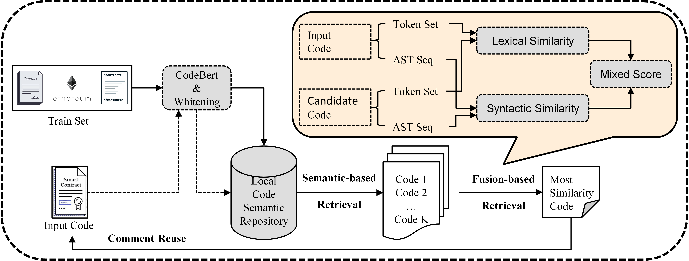
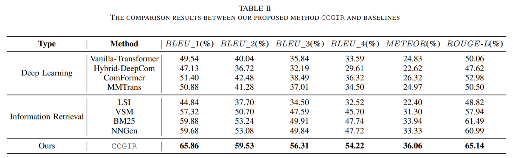

# Model:

# Compare:

# Note:

1. All baseline-generated annotations of RQ1 species are placed in the result folder, where 'True.csv' is the reference annotation.

2. The test set is placed in the data folder and includes the cleaned up code, AST sequences and comments.
3. More information to be comming soon.

