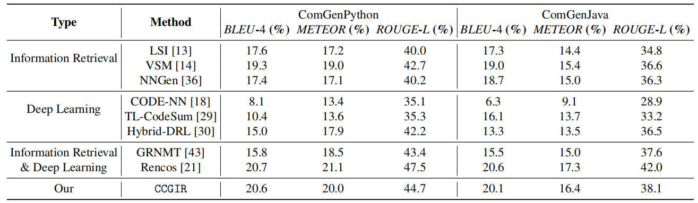

# Model:

# Compare:

1、智能合约数据集(超过SOTA蛮多的)

2、Java和Python数据集（性能第二，还不用训练，你说气人不）

# Note:

1. "data"目录下包括了训练集和测试集以及去重之后的原始数据。
2. "model"目录下是由CodeBert生成的向量仓库以及whitening求解出kernel和bias（需要将[CodeBert](https://huggingface.co/microsoft/codebert-base)下载放在model/codebert目录下），因为向量仓库太大了，我压缩成code_vector_whitening.rar，需要解压code_vector_whitening.pkl在model目录下。
3. "nodel_modules"是用来解析智能合约的nodejs库，需要执行npm install @solidity-parser/parser，参考https://github.com/solidity-parser/parser。
4. "result"是所有方法生成的注释，包括baselines，CCRIR和真实的注释。
5. static和templates是做的页面插件代码
6. app.py是页面插件启动代码。
7. util.py是工具包，包括AST解析，代码预处理和注释预处理。
8. temp.py是封装的一个临时测试文件。
9. bert_whitening.py是使用CodeBert+whitening操作的文件。
10. CCGIR.py是封装的检索文件，使用到了Faiss-CPU。

# How to run in the new corpus:

1.打开bert_whitening.py，第8行POOLING方法可自行选择，我选的是'first_last_avg'，效果最好。第13行的N_COMPONENTS就是选择降维后的维度，经过超参验证，256比较好。第14行的MAX_LENGTH，是输入到codebert之前的分词，选择的最大长度，可以理解位截长补短。在28，29行有个tqdm，自行选择开不开。84行的pd.read_csv()，里面的文件改成新的训练集的代码文件。第99，102，105行，根据自己的需要修改保存路径地址。

改完之后，运行main函数。跑完得到训练集的语义向量库，kernel和bias。

2.打开CCGIR.py，第14行的dim就是选择降维后的维度。接下来修改下16到27行的文件地址，修改第45，48，51行的文件地址。在新的测试集/验证集上直接运行main函数就行。

# Disadvantage

CCGIR不适用于以下情况的语料库：

1.代码复用率很低的数据集（例如伪代码生成的Django数据集）

2.codebert预训练过的数据集（ **[CodeXGLUE](https://github.com/microsoft/CodeXGLUE)**上的6个数据集，也不要用codebert继续在新的语料库上MLM继续预训练语言模型，性能会下降。）

# BibTeX entry and citation info

CCGIR方法简单，不用额外训练，效果还行，非常适合作为baseline进行对比实验，觉得有帮助欢迎引用。

等under review。。。

